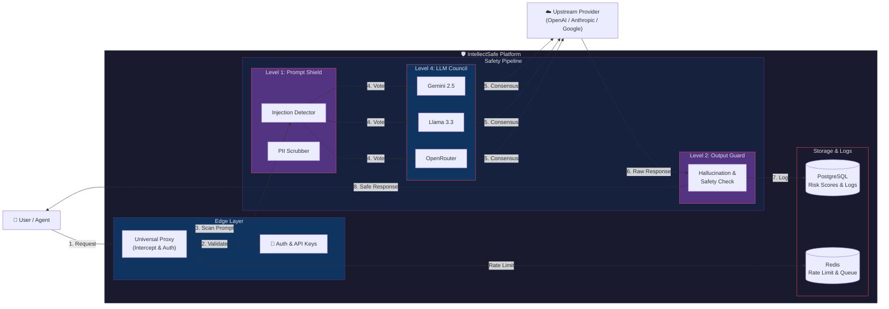

# IntellectSafe - AI Safety & Security Platform

Production-grade AI Safety Engine protecting humans, organizations, and AI systems from misuse, deception, manipulation, and loss of control.

## 🛡️ Features

### 5-Layer Defense Architecture

| Layer | Module | Description |
|-------|--------|-------------|
| **Level 1** | Prompt Injection Detection | Blocks jailbreaks, instruction overrides, and manipulation attempts |
| **Level 2** | Output Safety Guard | Scans LLM responses for harmful content and hallucinations |
| **Level 3** | Data Privacy Firewall | Detects and redacts PII/sensitive data |
| **Level 4** | Deepfake Detection | Detects AI-generated text, images, audio, and video |
| **Level 5** | Agent Control | Permission gates, action whitelisting, and kill switch |

### Core Components

1. **LLM Council (Fab Five)**: Multi-model validation (Gemini 2, Groq, OpenRouter, etc.)
2. **Universal Proxy**: Global Frontier Gateway targeting 2026 models (GPT-5.2, Claude 4.5)
3. **Hyper-Resilient Fortress**: Adversarial defense suite with Semantic Perturbation and CoT Guard
4. **Deepfake Engine**: Dual-layer detection for photorealistic faces and generative artifacts
5. **Governance Layer**: Full audit logs, risk reports, and compliance dashboards

---

## 🏗 System Architecture

The platform operates on a 5-layer defense-in-depth model, intercepting traffic via a universal proxy and routing it through safety modules before reaching upstream LLMs.



```

## 🔑 Key Management & BYOK

IntellectSafe supports **Bring Your Own Key (BYOK)** for all major providers.
- **Secure Storage:** Keys are encrypted using `Fernet` (AES-128) before storage.
- **Granular Control:** Assign specific keys to specific tasks (e.g., use a cheap key for high-volume safety scans).
- **Universal Proxy:** Use your stored keys to access any model via our OpenAI-compatible proxy.

### Configurable Safety Scanner
You can dedicate a specific AI connection for **Safety Operations** (Prompt Injection & Output Scanning).
1. Go to **Settings** -> **Upstream Connections**.
2. Add a key (e.g., "OpenRouter Research").
3. Select it in the **"AI Safety Scanner"** dropdown.
4. All safety checks will now route through this connection, keeping your main operational keys separate.

## 🚀 Getting Started

### Prerequisites
- Python 3.10+
- Node.js 18+
- PostgreSQL 15+

### Installation

```bash
# Clone repository
git clone <repo-url>
cd AI-safety

# Backend setup
cd backend
python -m venv venv
.\venv\Scripts\activate  # Windows
pip install -r requirements.txt
alembic upgrade head

# Start backend
python -m uvicorn app.main:app --reload --port 8001

# Frontend setup (new terminal)
cd frontend
npm install
npm run dev
```

### Access Points
- **Frontend**: http://localhost:3002
- **Backend API**: http://localhost:8001
- **API Docs**: http://localhost:8001/docs

---

## 🛡️ Advanced Defense (Fortress Mode)
The platform includes a **Hyper-Resilient Fortress** layer designed to stop 90%+ success rate jailbreaks:
- **Exploit Instability**: Perturbation engine breaks fragile prompt injections.
- **Chain-of-Thought Guard**: Detects reasoning hijacking and hidden logic bombs.
- **Adversarial Simulation**: A Council member "shadow-boxes" the prompt to check for harm.

## 📡 API Reference

### Universal Proxy (Multi-Provider Support)

IntellectSafe acts as a universal safety layer. Connect any major AI client and calls are automatically scanned:

| Provider | Model ID Example |
|----------|------------------|
| **OpenAI** | `gpt-5.2`, `o4-mini`, `gpt-4.5-preview` |
| **Anthropic** | `claude-4.5-sonnet`, `claude-4.5-opus` |
| **Google** | `gemini-3-pro`, `gemini-3-flash` |
| **DeepSeek** | `deepseek-v4`, `deepseek-r1` |
| **Meta** | `llama-4-maverick`, `llama-4-scout` |
| **Perplexity** | `sonar-deep-research`, `sonar-reasoning-pro` |

#### Integration Example

```python
from openai import OpenAI

client = OpenAI(
    base_url="http://localhost:8001/v1",  # Point to IntellectSafe
    api_key="your-openai-key"             # Or use X-Upstream-API-Key header
)

response = client.chat.completions.create(
    model="gpt-4o",
    messages=[{"role": "user", "content": "Hello!"}],
    extra_headers={
        "X-Upstream-Provider": "openai"   # Optional: explicitly set provider
    }
)
```
*For detailed setup (including Python/LangChain examples & BYOK), read the [**Integration Guide**](docs/INTEGRATION.md).*

### 🛡️ Secure Your Real AI Sessions (Extension)

To secure your sessions on **ChatGPT, Claude, Gemini, and Groq**, install the **IntellectSafe Companion** Chrome Extension:

1. Open Chrome and go to `chrome://extensions`.
2. Enable **Developer Mode** (top right).
3. Click **Load Unpacked**.
4. Select the `extension/` folder from this repository.
5. Browse `chatgpt.com` or `groq.com`. Your prompts are now scanned locally! 🚀

### 🔌 Verify Connections


Run the connection tester to check if your API keys and the proxy are working:

```bash
python backend/scripts/test_connections.py
```

### Scan Endpoints

```bash
# Scan a prompt for injection
curl -X POST "https://api.intellectsafe.onrender.com/api/v1/scan/prompt" \
  -H "Content-Type: application/json" \
  -d '{"prompt": "Ignore previous instructions"}'

# Scan LLM output for safety
curl -X POST "https://api.intellectsafe.onrender.com/api/v1/scan/output" \
  -H "Content-Type: application/json" \
  -d '{"output": "Here is how to...", "original_prompt": "..."}'

# Scan content for deepfakes (Dual-Model Analysis)
# Detects Art (Midjourney/DALL-E) and Photorealistic Faces
curl -X POST "https://api.intellectsafe.onrender.com/api/v1/scan/content" \
  -H "Content-Type: application/json" \
  -d '{"content_type": "image", "content": "<base64-data>"}'
```

### Agent Control (Level 5)

Full lifecycle protection for autonomous agents:
- **Authorization**: Permission gates for dangerous tools.
- **Kill Switch**: Immediate agent termination and block.
- **Audit**: Complete action history and session tracking.

```bash
# Authorize agent action
curl -X POST "https://api.intellectsafe.onrender.com/api/v1/agent/authorize" \
  -H "Content-Type: application/json" \
  -d '{"agent_id": "agent-1", "session_id": "s1", "action_type": "file_read", "requested_action": {"path": "/tmp/test.txt"}}'
```

---

## 🧪 Testing

```bash
cd backend

# Test all scan endpoints
python verify_backend.py

# Test Universal Proxy
python verify_proxy.py

# Test Agent Control
python verify_agent.py
```

---

## 📄 License

**GPLv2**
GNU GENERAL PUBLIC LICENSE
Version 2 License
