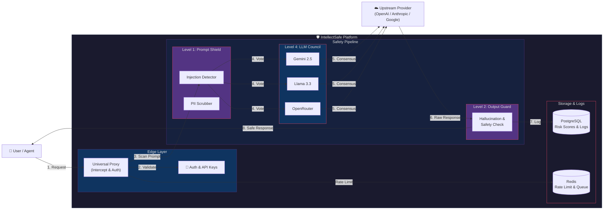

# IntellectSafe - AI Safety & Security Platform

Production-grade AI Safety Engine protecting humans, organizations, and AI systems from misuse, deception, manipulation, and loss of control.

## 🛡️ Features

### 5-Layer Defense Architecture

| Layer | Module | Description |
|-------|--------|-------------|
| **Level 1** | Prompt Injection Detection | Blocks jailbreaks, instruction overrides, and manipulation attempts |
| **Level 2** | Output Safety Guard | Scans LLM responses for harmful content and hallucinations |
| **Level 3** | Data Privacy Firewall | Detects and redacts PII/sensitive data |
| **Level 4** | Deepfake Detection | Detects AI-generated text, images, audio, and video |
| **Level 5** | Agent Control | Permission gates, action whitelisting, and kill switch |

### Core Components

1. **LLM Council (Fab Five)**: Multi-model validation (Gemini 2, Groq, OpenRouter, etc.)
2. **Universal Proxy**: Global Frontier Gateway targeting 2026 models (GPT-5.2, Claude 4.5)
3. **Hyper-Resilient Fortress**: Adversarial defense suite with Semantic Perturbation and CoT Guard
4. **Deepfake Engine**: Dual-layer detection for photorealistic faces and generative artifacts
5. **Governance Layer**: Full audit logs, risk reports, and compliance dashboards

---

## 🏗 System Architecture

The platform operates on a 5-layer defense-in-depth model, intercepting traffic via a universal proxy and routing it through safety modules before reaching upstream LLMs.


```mermaid
flowchart LR
    User["👤 User / Agent"]

    subgraph Platform["🛡️ IntellectSafe Platform"]
        direction TB

        subgraph Edge["Edge Layer"]
            Proxy["Universal Proxy\n(Intercept & Auth)"]
            Auth["🔑 Auth & API Keys"]
        end

        subgraph Safety["Safety Pipeline"]
            direction TB
            subgraph L1["Level 1: Prompt Shield"]
                Inject["Injection Detector"]
                PII["PII Scrubber"]
            end

            subgraph L4["Level 4: LLM Council"]
                Gemini["Gemini 2.5"]
                Llama["Llama 3.3"]
                OpenRouter["OpenRouter"]
            end

            subgraph L2["Level 2: Output Guard"]
                OutputScan["Hallucination &\nSafety Check"]
            end
        end

        subgraph Storage["Storage & Logs"]
            DB[("PostgreSQL\nRisk Scores & Logs")]
            Redis[("Redis\nRate Limit & Queue")]
        end
    end

    Upstream["☁️ Upstream Provider\n(OpenAI / Anthropic / Google)"]

    User -->|"1. Request"| Proxy
    Proxy -->|"2. Validate"| Auth
    Proxy -->|"3. Scan Prompt"| Inject
    Inject -->|"4. Vote"| Gemini
    Inject -->|"4. Vote"| Llama
    Inject -->|"4. Vote"| OpenRouter
    Gemini -->|"5. Consensus"| Upstream
    Llama -->|"5. Consensus"| Upstream
    OpenRouter -->|"5. Consensus"| Upstream
    Upstream -->|"6. Raw Response"| OutputScan
    OutputScan -->|"7. Log"| DB
    Proxy -->|"Rate Limit"| Redis
    OutputScan -->|"8. Safe Response"| User

    style Platform fill:#1a1a2e,stroke:#16213e,color:#e0e0e0
    style Edge fill:#0f3460,stroke:#533483,color:#e0e0e0
    style Safety fill:#16213e,stroke:#533483,color:#e0e0e0
    style Storage fill:#1a1a2e,stroke:#e94560,color:#e0e0e0
    style L1 fill:#533483,stroke:#e94560,color:#e0e0e0
    style L4 fill:#0f3460,stroke:#e94560,color:#e0e0e0
    style L2 fill:#533483,stroke:#e94560,color:#e0e0e0
```

```

## 🔑 Key Management & BYOK

IntellectSafe supports **Bring Your Own Key (BYOK)** for all major providers.
- **Secure Storage:** Keys are encrypted using `Fernet` (AES-128) before storage.
- **Granular Control:** Assign specific keys to specific tasks (e.g., use a cheap key for high-volume safety scans).
- **Universal Proxy:** Use your stored keys to access any model via our OpenAI-compatible proxy.

### Configurable Safety Scanner
You can dedicate a specific AI connection for **Safety Operations** (Prompt Injection & Output Scanning).
1. Go to **Settings** -> **Upstream Connections**.
2. Add a key (e.g., "OpenRouter Research").
3. Select it in the **"AI Safety Scanner"** dropdown.
4. All safety checks will now route through this connection, keeping your main operational keys separate.

## 🚀 Getting Started

### Prerequisites
- Python 3.10+
- Node.js 18+
- PostgreSQL 15+

### Installation

```bash
# Clone repository
git clone https://github.com/HOLYKEYZ/IntellectSafe
cd IntellectSafe

# Backend setup
cd backend
python -m venv venv
.\venv\Scripts\activate  # Windows
pip install -r requirements.txt
alembic upgrade head

# Start backend
python -m uvicorn app.main:app --reload --port 8001

# Frontend setup (new terminal)
cd frontend
npm install
npm run dev
```

### Access Points
- **Frontend**: http://localhost:3002
- **Backend API**: http://localhost:8001
- **API Docs**: http://localhost:8001/docs

---

## 🛡️ Advanced Defense (Fortress Mode)
The platform includes a **Hyper-Resilient Fortress** layer designed to stop 90%+ success rate jailbreaks:
- **Exploit Instability**: Perturbation engine breaks fragile pro